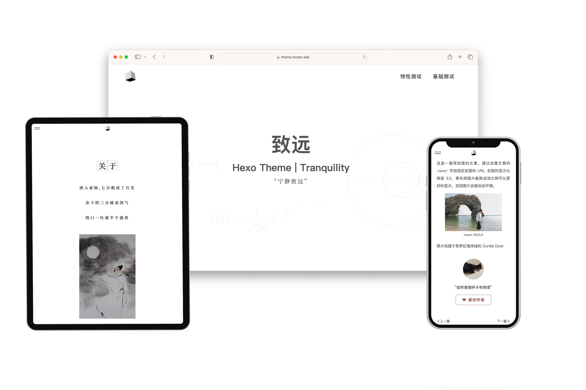
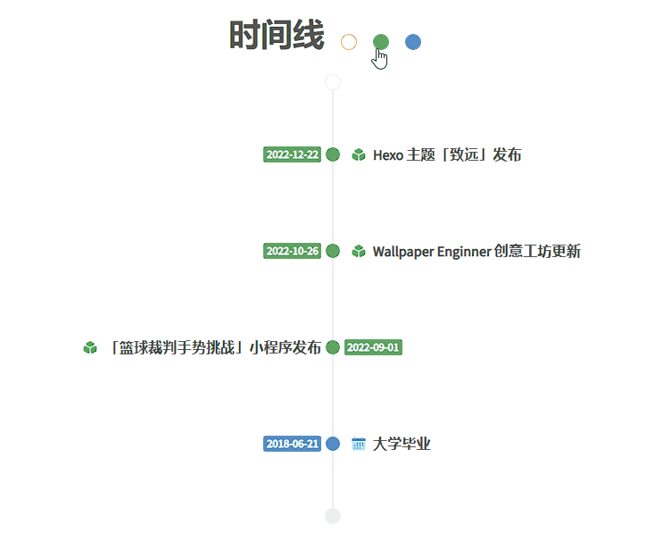

<h1> <div align="center"> 致远</div></h1>

<p align="center">致远是一款 Hexo 主题，专门为个人主页及多学科领域博主设计</p>

<p align="center">
<a href="https://github.com/hooozen/hexo-theme-tranquility/releases"></a>
<a href="https://hexo.io/"></a>
<a href="https://github.com/hooozen/hexo-theme-tranquility/blob/main/LICENSE"></a>


</p>

演示站：

- [致远](https://theme.hozen.site/tranquility/)
- [浩然的主页](https://www.hozen.site)

## 特点

- 主页风格，聚焦个性展示
- [“子页”设计](#子页)，适应多领域写作
- 三端自适应，舒适阅读
- 自定义字体及提取压缩，兼具美观和性能
- [简历制作](#简历)、[时间线](#时间线)、[相关文章](#相关文章)、[数学公式](#数学公式)、[Gitalk 评论](#其他)、[赞赏](#文章赞赏)、[SEO](#其他)
- 等

 -----

## 目录

- [安装](#安装)
- [升级](#升级)
- [设计逻辑](#设计逻辑)
  - [改变](#改变)
- [配置](#配置)
  - [子页](#子页)
  - [首页自定义](#首页自定义)
  - [页脚自定义](#页脚自定义)
  - [时间线](#时间线)
  - [简历](#简历)
  - [数学公式](#数学公式)
  - [代码高亮](#代码高亮)
  - [标签云](#标签云)
  - [文章封面](#文章封面)
  - [文章置顶](#文章置顶)
  - [文章置顶](#文章置顶)
  - [文章赞赏](#文章赞赏)
  - [相关文章](#相关文章)
  - [其他](#其他)

## 安装

0. 前置条件：[node(>=16)](https://nodejs.org/en)、[Git](https://git-scm.com/)、[Hexo](https://hexo.io/) 以及使用 Hexo 博客文件。如果你还不了解以上内容，请从[这里](https://hexo.io/zh-cn/docs/)获取相关帮助。

1. 下载本仓库的文件到你的 Hexo 目录的 `themes\tranquility` 文件夹下:

    ```sh
    cd hexo
    git clone https://github.com/hooozen/hexo-theme-tranquility.git themes/tranquility
    ```

2. 并配置根目录下 `_config.yml` 中的 `theme` 字段为 `tranquility`（参考 [主题 | Hexo](https://hexo.io/zh-cn/docs/themes))。

3. 移除冲突的依赖，并安装必要依赖:

    ```bash
    npm uninstall hexo-generator-category hexo-generator-archive
    npm install hexo-pagination moment opentype.js
    ```

4. 主题配置
    将主题目录下的配置文件 `themes/tranquility/_config-template.yml` 复制到博客文件根目录下，并重命名为 `_config.tranquility.yml`。在 `_config.tranquility.yml` 个性化主题配置，具体的配置项查看[主题配置](#主题配置)或阅读配置文件的注释。

## 升级

本主题在不停迭代，当使用过程中遇到问题时可以查看主题是否已经有了更新。主题升级的步骤如下：

- 进入主题目录拉取更新

    ```bash
    cd themes/tranquility
    git pull
    ```

- 阅读[更新说明](https://github.com/hooozen/hexo-theme-tranquility/releases)，并查看 `themes/tranquility/_config-template.yml` 的新增和修改项，对应修改你的 `_theme.tranuility.yml` 文件

## 设计逻辑

本主题改变了 Hexo 的默认设计逻辑，所以与大多数的 Hexo 主题的用法不同，请参考下文。

大多数的 Hexo 主题的设计目的是在于**纯粹的博客记录**，并且博主的博客内容往往集中于单一学科领域（如互联网技术）。因此在这个需求驱动下，大多数 Hexo 主题被设计为主页展示文章列表，并使用繁多的分类（Category）为文章进行细分。这种设计很好的满足了需求。

当用户需要一个能够展示个人特点的主页，并且需要对博客的内容进行**明确**的领域划分时，这些主题并不能很好的满足这些需求。因此“致远”主题被设计出来，同时也规定了用户群体。

### 改变

主页并不展示文章列表，而是展示具有个人特点的内容，如“关于”和“时间线”模块。

引入“子页”的概念来取代“分类”（Category），所有的子页都在导航栏具有一级入口。基于此，子页的概念应该更广，往往为某一个学科大类或者领域，例如所有的互联网技术博文应该被划分为一个“子页”中，不管它属于“前端技术”还是“服务端技术”。

对于同属一个“子页”的文章，借鉴了微信公众号的分类逻辑，使用标签（Tag）来对文章进行分类和聚合。因此主题中**没有了**默认的 Category 的概念和入口，取而代之的是“子页”（Subpage）与“标签”（Tag）的概念。  

有关该主题的设计理念，如果这里的描述不够清楚，打开[演示站](https://www.hozen.site)浏览一下应该就明白了。如果无法理解这种改变，可能是因为您并没有这种需求，使用其他 Hexo 主题可能会是更好的选择。

## 配置

经过[安装](#安装)步骤，你在博客根目录下已经有了一个 `_config.tranquility.yml` 文件。如没有，请阅读并检查[安装步骤](#安装)。如不加说明，该部分的配置均在博客更目录下的 `_config.tranquility.yml` 文件进行。

本章所有的配置内容你都可以在 [致远](https://theme.www.hozen.site/tranquility/) 网站找到对应的测试文章，并在 [hooozen/hexo-theme-test](https://github.com/hooozen/hexo-theme-test) 仓库中找到对应的配置文件。所以当哪个配置项说明读不懂时不妨去找一下对应的例子。

### 子页

子页的配置在 `subpage` 下进行：

```yml
subpage: # 开启“子页”功能，详见 README
  enable: true  # 是否开启子页功能
  pages:  # 子页数组
    - name: # 子页标识，如 developer
      path: # 若不设置则默认使用 name
      title: # 显式在导航栏的菜单名，如 开发者
      icon: # 图标的路径
      description: # 描述
```

若关闭子页功能（`enbale: false`），则导航栏只会有一个“博客”按钮，点击该按钮就会进入所有文章列表。

若开启子页功能（`enbale: true`），则必须配置 `pages` 数组。该数组中使用 `name` 标识子页。`path` 指定子页的路径，默认使用 `name`。该数组的 `title` 会展示在导航栏的菜单中。配置完毕后，`pages` 数组中的所有项都会以 `title` 为名展示在网页的头部导航栏，点击每一项进入相应的子页。`icon` 和 `description` 用于配置子页中的图标和表述。

例如，[致远](https://theme.hozen.site/tranquility/)所使用的[子页配置](https://github.com/hooozen/hexo-theme-test/blob/main/_config.tranquility.yml#L13)。

新建文章后，只需要把文章头部的 `category` 字段设置为某子页的 `name` 即可将该文章划分到该子页下。

### 时间线

时间线的设计初衷是为了展示博主的**重要**事件或履历，如荣誉、宿醉、死亡等[<sup>[1]</sup>](#ref1)。

你也可以用它来展示精选文章或其他内容，时间线支持自定义配置。



时间线的配置在 `timeline` 下进行

```yml
timeline:
  enable: true  # 是否开启时间线
  reversed_order: true # 是否按时间倒序展示
  items:  # 配置时间线分类
    - name: article  # 分类名称
      color: "#ee936c"  # 分类主题色
      icon: /images/icon/icon-article.svg  # 分类图标
      checked: false  # 是否默认展示
    - name: apps
      color: "#60a465"
      icon: /images/icon/icon-app.svg
      checked: true
    - name: event
      color: "#568dc4"
      icon: /images/icon/icon-event.svg
      checked: false
```

在文章中配置 `timeline` 字段并指定时间线分类名称后，该文章会展示在时间线列表中，例如：

```yml
---
id: 57
title: 多少冬天
date: 2022-11-30 23:23:48
tags: 
  - 散文
categories: life  # 属于 life 子类下
cover: /assets/images/57-1.jpg
timeline: article  # 展示在时间线列表中
---
```

有关时间线的配置修改**可能需要重新启动服务**才会生效

### 简历

此功能提供一个线上简历页面，通过浏览器的打印功能可以导出 PDF，并且通过超链接保持简历的时效。通过主题配置文件的 `cv` 字段配置。

首先需要安装以下依赖：

```
npm install @fortawesome/fontawesome-svg-core --save
npm install @fortawesome/free-solid-svg-icons --save
npm install @fortawesome/free-regular-svg-icons --save
npm install @fortawesome/free-brands-svg-icons --save
```

博客的基础配置如下：

- `enable: true` 是否开启简历功能
- `showInNav: true` 是否在网站导航栏显示(需 `enable` 为 `true`)
- `keywords: ...` 简历页的关键词(SEO)
- `description: ...` 简历页的描述(SEO)
- `title: ...'cv` 简历页的标题
- `iconPrefix: fas` 简历中 fontawesome 图标使用的风格

博客的内容配置(`cv.content`)分为以下几块：

1. 标题(title)
2. 基本信息(baseInfo)
3. 教育背景(edu)
4. 超链接(tel | email | github | (blog & blogHref))
5. 自定义模块(chapters)

其中前 4 个配置是必需的(超链接可任选若干)，配置比较简单请参考演示项目的配置。

对于自定义模块用户根据自身情况自行添加，例如“工作经历”、“项目经历”、“自我评价”等。其配置方法如下：

任何一个自定义模块视为 `chapters` 数组中的一个章节，有以下基本属性：

- `title: string` 标题
- `icon: string` 图标
- `tips?: string` 提示，可选
- `content?: string[]` 内容(与 `sections` 二选一)
- `sections?: Section[]` 分节(与 `content` 二选一)

其中图标使用 fontawesome 的图标插件，去它的[图标库](https://fontawesome.com/search?o=r&m=free)搜索你想使用的图标名称即可。

内容的配置分为 `content` 和 `sections` 两种，若使用 `content` 则在该字段下输入分段数组来构成所在模块的内容。适合简单的场景，例如自我评价.

```yml
chapters:
  - ...
    ...
  - title: 个人小结
    icon: ranking-star
    content:
      - 第一段文本
      - 第二段文本
      - ...
```

而对于工作经历等模块，需要在模块中分节来介绍若干个工作经历或项目经历，则使用 `sections` 配置:

```yml
  - ...
    ...
  - title: 个人小结
    icon: ranking-star
    sections:
      - ...
```

每个 `section` 的配置字段如下：

- `title: string` 标题
- `link?: string` 链接，可选
- `description: string` 描述
- `content: string[]` 内容

### 代码高亮

代码高亮依赖于博客**根目录**下的 `_config.yml` 的`highlight` 配置，请配置如下：

```yml
highlight:
  enable: true
  line_number: true
  auto_detect: false
  tab_replace: ""
  wrap: true
  hljs: true
prismjs:
  enable: false
  preprocess: true
  line_number: true
  tab_replace: ""

```

### 数学公式

主题有两种方式开启对 Latex 数学公式的支持，但都需要先进行以下操作：

- **移除** Hexo 默认的 markdown 渲染插件 `hexo-renderer-marked`，并安装 `hexo-renderer-pandoc`。如果安装了其他的 markdown 渲染插件也请移除！

  ```bash
  npm uninstall hexo-renderer-marked
  npm install hexo-renderer-pandoc
  ```

- 安装 pandoc 软件，查看 [pandoc.org](https://www.pandoc.org/)。

第一种方法，使用主题预置的 Latex 解析，直接在配置文件中开启 `mathjax` 即可使用

```yml
mathjax: true # 加载 LateX 数学公式库
```

第二种方法，使用第三方插件 [hexo-filter-mathjax](https://github.com/next-theme/hexo-filter-mathjax) 进行服务端渲染。并关闭配置文件中的 `mathjax: false`

从访问性能来讲，推荐使用第二种方法。

### 首页自定义

- 查看 `index` 配置项

### 页脚自定义

- `foot.title` 配置页脚显式的标语

- `links` 配置友链

- `social` 配置社交帐户或其他链接

### 标签云

标签云出现在每个子页的首页，用来展示该子页下文章的标签分布。标签云有两种形式：3D 动画云和静态标签云。

- `tagcloud.fancy` 选择是否开启 3D 动画云
- `tagcloud` 的其他选项用以配置 3D 标签云，参考 [tagcloud](https://hexo.io/zh-cn/docs/helpers#tagcloud)

### 文章封面

- 文章列表封面图片的配置，通过设置文章头部的 `cover` 字段指定封面图片的 URL

### 文章目录

- 通过在文章头部配置 `toc: true` 来展示文章目录。具有较多层级结构的文章推荐开启，而散文等文本类可以关闭。

### 文章置顶

- 通过数字来指定文章头部的 `sticky` 属性对文章进行置顶，数字越大置顶优先级越高。数字都需要大于 `0`。

### 文章赞赏

- 配置项 `reward` 进行文章赞赏配置，包括头像、二维码和语句等。

### 相关文章

相关文章用来在每篇文章底部展示与本篇文章相关的推荐文章。

- 首先安装依赖

    ```bash
    npm install hexo-related-popular-posts
    ```

- 通过 `related_post` 配置项进行配置，具体配置查看[插件文档](https://github.com/tea3/hexo-related-popular-posts)。

### 自定义字体

主题的部分区域为了设计感使用了第三方的汉字字体。但由于汉字字体包太大，因此本主题对用户使用的部分字体进行了提取打包成子字体。

通过 `zh_font` 配置项进行开启或关闭

### 其他

请他配置请查看配置文件注释

- gitalk 文章评论
- 百度 SEO
- 等

-----

<div id='ref1'></div>
[1]. 引用了英雄联盟角色亚索的台词：“生命中有三件必经之事，荣誉、死亡，还有……宿醉……” 😜
