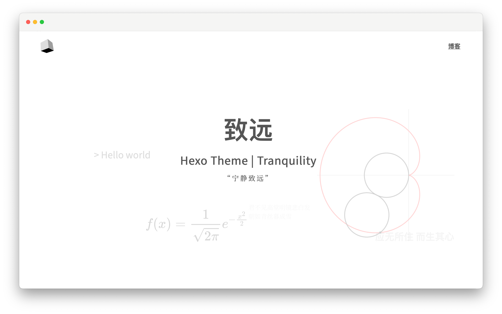

<h1> <div align="center"> 致远</div></h1>

<p align="center">致远是一款 Hexo 主题，主要为个人主页及多学科领域博主设计。</p>

<p align="center">
<a href="https://github.com/hooozen/hexo-theme-tranquility/releases"></a>
<a href="https://hexo.io/"></a>
<a href="https://github.com/hooozen/hexo-theme-tranquility/blob/main/LICENSE"></a>


</p>

演示站：[浩然的主页](https://www.hozen.site)

## 安装

下载本仓库的文件到你的 Hexo 目录的 `themes\tranquility` 文件夹下：

```sh
cd hexo
git clone https://github.com/hooozen/hexo-theme-tranquility.git themes/tranquility
```

并配置根目录下 `_config.yml` 中的 `theme` 字段为 `tranquility`。

参考 [主题 | Hexo](https://hexo.io/zh-cn/docs/themes)。

## 设计逻辑

本主题改变了 Hexo 的默认设计逻辑，所以与大多数的 Hexo 主题的用法不同，请参考下文。

大多数的 Hexo 主题的设计目的是在于**纯粹的博客记录**，并且博主的博客内容往往集中于单一学科领域（如互联网技术）。因此在这个需求驱动下，大多数 Hexo 主题被设计为主页展示文章列表，并使用繁多的分类（Category）为文章进行细分。这种设计很好的满足了需求。

当用户需要一个能够展示个人特点的主页，并且需要对博客的内容进行**明确**的领域划分时，这些主题并不能很好的满足这些需求。因此“致远”主题被设计出来，也被规定了目标群体。

### 改变

主页并不展示文章列表，而是展示具有个人特点的内容，如“关于”和“时间线”功能。

引入“子页”的概念来取代“分类”（Category），所有的子页都在导航栏具有一级入口。基于此，子页的概念应该更广，往往为某一个学科大类或者领域，例如所有的互联网技术博文应该被划分为一个“子页”中，不管它属于“前端技术”还是“服务端技术”。

对于同属一个“子页”的文章，借鉴了微信公众号的分类逻辑，使用标签（Tag）来对文章进行分类和聚合。因此主题中（几乎<sup>注</sup>）没有了默认的 Category 的概念和入口，取而代之的是“子页”（Subpage）与“标签”（Tag）的概念。  
（*注：虽然“子页”的概念取代了“分类”，但底层的实现仍然是基于分类的。并且虽然分类的入口被取消，但仍然可以通过 URL 进行访问。之所以这么做是出于兼容性考虑，但不推荐用户使用时仍采用“分类”的概念去部署文章。*）

有关该主题的设计理念，如果这里的描述不够清楚，打开[演示站](https://www.hozen.site)浏览一下应该就明白了。如果仍无法理解，可能是因为你并没有这种需求。

## 主题配置

主题目录中的默认配置是完全兼容 Hexo 的默认设计的。如果想要发挥该主题的设计初衷，需要开启“子页”配置。

### 子页功能 subpage

```yml
subpage: # 开启“子页”功能，详见 README
  enable: false
  pages:
    - name: # 文章的分类（category）名，如 developer
      path: # 若不设置则默认使用 name
      title: # 菜单名，如 开发者
      icon: # 图标的路径
      description: # 描述
```

若关闭子页功能（`enbale: false`），则导航栏只会有一个“博客”按钮，点击该按钮就会进入所有文章列表。

若开启子夜功能（`enbale: true`），则必须配置 `pages` 数组。该数组中的 `name` 字段即为要被设置为子页的**文章分类名**。`path` 指定子页的路径，默认使用 `name`。该数组的 `title` 会展示在导航栏的菜单中。配置完毕后，`pages` 数组中的所有项都会以 `title` 为名展示在网页的头部导航栏，点击每一项进入相应的子页。

“子页”实际上就是原来的“分类页”，在该页下会展示属于该分类（`name`字段）的文章列表。`icon` 和 `description` 用于配置子页中的图标和表述。

### 时间线

为文章添加 `selected` 字段并设置为 `true` 即可添加至首页时间线中。如：

```
---
id: 57
title: 多少冬天
date: 2022-11-30 23:23:48
tags: 
- 散文
categories: life
cover: /assets/images/57-1.jpg
selected: true
---
```

目前主题支持 3 种时间线事件，分别为“文章”、“事件”、“App”。文章则通过上述配置 `selected:true` 来添加到时间线。“事件”则需要在文章种配置 `type: event`，“APP”则配置为 `type: app`。

这 3 种时间线事件会在主页时间线使用不同的颜色和图标展示，并默认展示“事件”和“App”，通过点击“时间线”旁边的 Radio 可以进行筛选。


*这三种事件的命名是常量，不可配置的，因此你不必受其名称影响，例如你可以使用 app 来标记其他类型的事件。这里后续会考虑进行配置化处理。*

### 其他

文章列表封面图片的配置，通过设置文章头部信息的 `cover` 字段配置，例如:
```
---
title: 题目
cover: https://img.shields.io/github/license/hooozen/hexo-theme-tranquility
...
---
```

其他配置参考主题目录下 `_config.yml` 的注释，包括：

* 数学公式的支持 （依赖 `hexo-renderer-pandoc` 和 pandoc）
* 首页内容配置
* 友链和社交媒体
* 相关文章（依赖 `hexo-related-popular-posts`）
* 文章赞赏
* gitalk 文章评论
* 百度 SEO
* 等

------

主题不断完善中，有问题和意见请指出：[Issues](https://github.com/hooozen/hexo-theme-tranquility/issues)。
